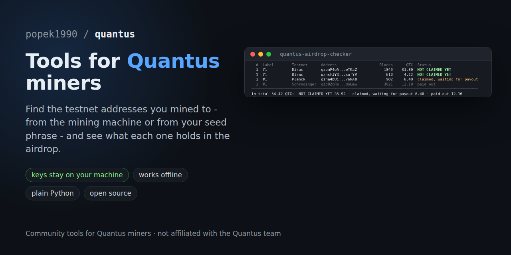

# quantus

**Small, open-source tools for people who mine or hold [Quantus](https://quantus.com) (QTC).**

Read the code, run it on your own machine, keep your keys to yourself.

[Tools](#tools) · [Ground rules](#ground-rules) · [quantus.watch](https://quantus.watch) · [x.com/popek_1990](https://x.com/popek_1990)

---

## Tools

| | Tool | What it does | Needs your seed phrase? |
|---|---|---|---|
| 🔎 | **[quantus-rewards-finder](quantus-rewards-finder/)** | Mined a testnet and lost track of your rewards address? Run this on the mining machine. It finds every rewards address the machine still remembers and shows its airdrop status. | **No** |
| 🌱 | **[quantus-airdrop-checker](quantus-airdrop-checker/)** | Have the seed phrase but not the machine? It derives every address the phrase ever had on the testnets and shows what each one holds in the airdrop, and whether it is still unclaimed. | **Yes** - it stays on your machine, works offline, and is never stored or sent |

Each tool lives in its own folder with its own README, tests and instructions.

## Ground rules

Every tool in this repo follows the same three rules:

- 🔐 **Your keys stay yours.** A tool that does not need a seed phrase never asks for one. The one that does (the airdrop checker) says so up front, explains why, never stores or sends it, and can run with the network unplugged. Anything else asking for your phrase in our name is a scam.
- 📖 **Plain code you can read before you run it.** Python or shell, no binaries in this repo. The airdrop checker runs the official Quantus builds, downloaded from Quantus' own GitHub releases and checked against SHA256 hashes pinned in the code.
- 🌐 **Nothing leaves your machine without saying so.** Network access is only ever a download of public files, and every tool's README lists exactly which.

## Also useful

📊 **[quantus.watch](https://quantus.watch)** - live Quantus data: airdrop progress, network hashrate and exchange flows.

---

Made by popek_1990 · [x.com/popek_1990](https://x.com/popek_1990)

Community project, not affiliated with the Quantus team · [MIT License](LICENSE)

